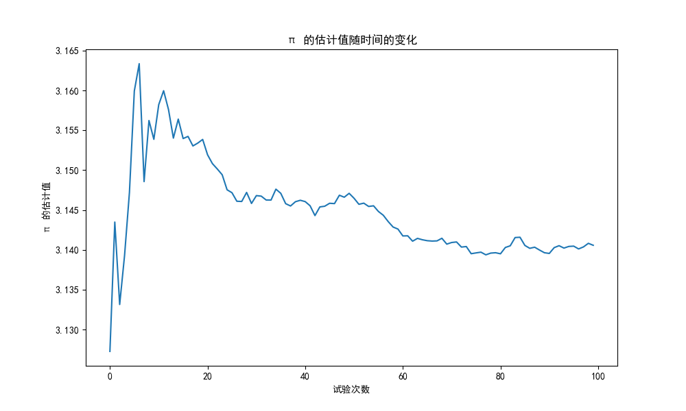
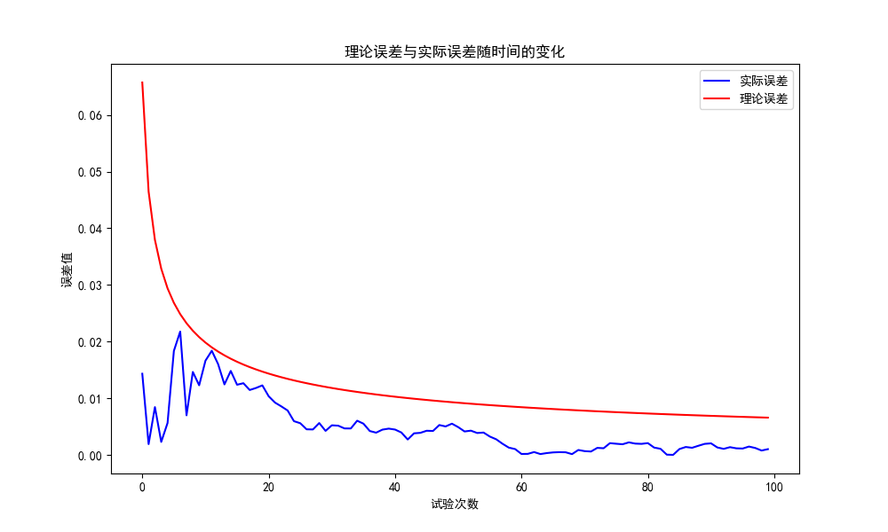

### 蒲丰投针法计算π值
##### 2023年11月21日
##### 夏泽宇 2021012242

##### 1.实验原理
蒲丰投针实验的设置如下：
在平面上有若干条平行且间距为$2a$的线，重复投掷长度为$2l$的针。
每次投针试验， 实际上是从两个均匀分布的随机变量中抽样得到$x$, $\theta$ ， 定义描述针与平行线相交状况的随机变量$s(x, \theta)$为：
$$ s(x, \theta)=\left\{
\begin{aligned}
& 1 & ,x\le lsin\theta\\
& 0 & ,otherwise\\
\end{aligned}
\right.
$$
投针与直线相交概率为：
$$
P=\iint s(x, \theta) f_1(x) f_2(\theta) d x d \theta=\int_0^\pi \frac{d \theta}{\pi} \int_0^{l \sin \theta} \frac{d x}{a}=\frac{2 l}{\pi a}
$$
于是有：
$$
\pi=\frac{2 l}{a P} \approx \frac{2 l}{a \bar{s}_N},其中\bar{s}_N=\frac{1}{N} \sum_{i=1}^N s\left(x_i, \theta_i\right)
$$

##### 2.实验结果
在$a=4$，$l=3$的条件下，进行了$N=1000000$次投针实验，得到$\pi$的估计值随实验次数增加的图像如下：

可以看到，随着实验次数的增加，$\pi$的估计值逐渐收敛于真实值$\pi$。实验最后的$\pi$估计值为$3.14058$

##### 3.误差分析
由于$\pi$的估计值为$\pi=\frac{2 l}{a \bar{s}_N}$，取2倍标准差计算，$\pi$的估计值的理论误差为：
$$\Delta \pi=\frac{\pi}{p} \frac{2 \sigma_p}{\sqrt{N}}=2 \pi \sqrt{\frac{1-p}{N p}}$$
通过计算$\pi$的实际误差与理论误差，得到如下图像：

可以看到，实际误差均在理论误差之内，实验结果可信。

##### 4.实验代码
代码见：/code/main.py