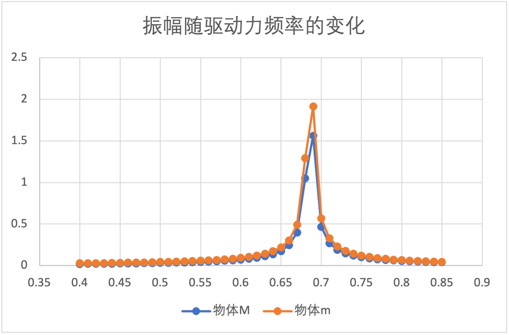

### 计算机模拟物理作业
##### 2023年10月18日
##### 夏泽宇 2021012242

##### 1.1
$设左侧弹簧长度为l_1,M初始位置为x_1。中间弹簧长度为l_2，m初始位置为x_2。可列出运动方程:$
$$
\begin{align}
    m_1\frac{d^2x_1}{dt^2}&=-k_1(x_1-l_1)+k_2(x_2-x_1-l_2)
    \\m_2\frac{d^2x_2}{dt^2}&=-Asin(\omega t)-k_2(x_2-x_1-l_2)
\end{align}
$$
\
$令X=\begin{bmatrix}
x_1 \\
x_2 \\
\end{bmatrix}，M=\begin{bmatrix}
m_{1} & 0  \\
0 & m_{2}\\
\end{bmatrix}，K=\begin{bmatrix}
-k_{1} - k_{2}& k_2  \\
k_2 & -k_2\\
\end{bmatrix}，
则有MX''=KX+b$
\
$共振频率仅有系统本身决定，因此可不考虑由外力带来的影响，即上式中的b项，仅考虑线性方程组MX''=KX$
$线性方程组可变形为X''=M^{-1}KX$
\
$注意到M^{-1}K可逆，因此可对角化为P^{-1}DP，其中D=diag\{\lambda_1,\lambda_2, \cdots \}$
\
$因此由PX''=DPX$
$令Z=PX，有Z''=DZ，即z_i''=\lambda_iz_i, i=1,2，可得z_i=Ae^{\sqrt{\lambda_i}x}+Be^{-\sqrt{\lambda_i}x}$
\
$代入数值得M=\begin{bmatrix}
20 & 0  \\
0 & 10\\
\end{bmatrix}，K=\begin{bmatrix}
-1600 & 1000  \\
1000 & -1000\\
\end{bmatrix}，M^{-1}K=\begin{bmatrix}
-80 & 50  \\
100 & -100\\
\end{bmatrix}$
\
$M^{-1}K的特征值\lambda_1=-18.5857, \lambda_2=-161.4143$
$$
\begin{aligned}
    z_1&=Ae^{\sqrt{18.5857}ix}+Be^{-\sqrt{18.5857}ix}=Asin(4.311x)+Bcos(4.311x)
    \\z_2&=Ae^{\sqrt{161.4143}ix}+Be^{-\sqrt{161.4143}ix}=Asin(12.705x)+Bcos(12.705x)
\end{aligned}
$$
$因此固有频率\omega_1=4.311\ rad/s，\omega_2=12.705\ rad/s。当驱动力为这2个频率时会发生共振$
\
$\omega=4.311\ rad/s时，物体运动随时间变化的x-t图像如下：$

\
$\omega=12.705\ rad/s时，物体运动随时间变化的x-t图像如下：$

\
$通过分析共振频率附近频谱的振幅，可得到以下图像$
$在共振频率\omega=4.311\ rad/s，即f=\frac{\omega}{2\pi}=0.686附近的振幅-频率关系如下 $

\
$在共振频率\omega=12.705\ rad/s，即f=\frac{\omega}{2\pi}=2.022附近的振幅-频率关系如下 $

\
$可见在共振频率附近，振幅会显著增大，且理论计算值与模拟值相当一致$

##### 1.2
$将外力改为矩形波，即：$
$$ f(t)=\left\{
\begin{aligned}
& A & ,kT\le t<(k+\frac{1}{2})T\\
& -A & ,(k+\frac{1}{2})T\le t<(k+1)T\\
\end{aligned}
\right.
$$
$在模拟中取A=5,T=\frac{1}{f}。在2个振动频率附近的振幅-频率关系见下图。$
$在共振频率f=0.686附近的振幅-频率关系如下： $

\
$在共振频率f=2.022附近的振幅-频率关系如下： $

\
$可以看出在矩形波的作用下，由于系统不变，共振频率仍为f=0.686Hz和2.022Hz。但由于驱动力的不同，整体振幅发生了变化。由于矩形波作用的力为定值，总体功更大，因此系统的振幅也更大。$

##### 2.1
$对于该运动方程$
$$
\frac{d^2 x}{d t^2}=-\omega_0^2 x-\gamma \frac{d x}{d t}
$$
$代入特征方程\lambda^2+\gamma \lambda+\omega_0^2=0$
$求根，得\lambda_{1,2}=\frac{-\gamma \pm \sqrt{\gamma^2-4 \omega_0^2}}{2}=-\frac{\gamma}{2} \pm \sqrt{\frac{\gamma^2}{4}-\omega_0^2}，x(t)=c_1e^{\lambda_1t}+c_2e^{\lambda_2t}$
$在欠阻尼状态下，\gamma^2-4 \omega_0^2<0$
$x(t)=e^{-\frac{\gamma}{2} t}\left(c_1 \cos \omega_1 t+c_2 \sin \omega_1 t\right)=e^{-\frac{\gamma}{2} t} A \cos \left(\omega_1 t+\phi\right)，其中\omega_1=\sqrt{\omega_0^2-\frac{\gamma^2}{4}}，因此共振频率即为\sqrt{\omega_0^2-\frac{\gamma^2}{4}}\approx2.9896\ rad/s$
\
$模拟得到的运动轨迹如下图$

##### 2.2
$临界阻尼系数即满足\omega_0^2-\frac{\gamma^2}{4}=0的\gamma值。在本题中\gamma=2\omega_0=6，模拟得到的图像如下$
