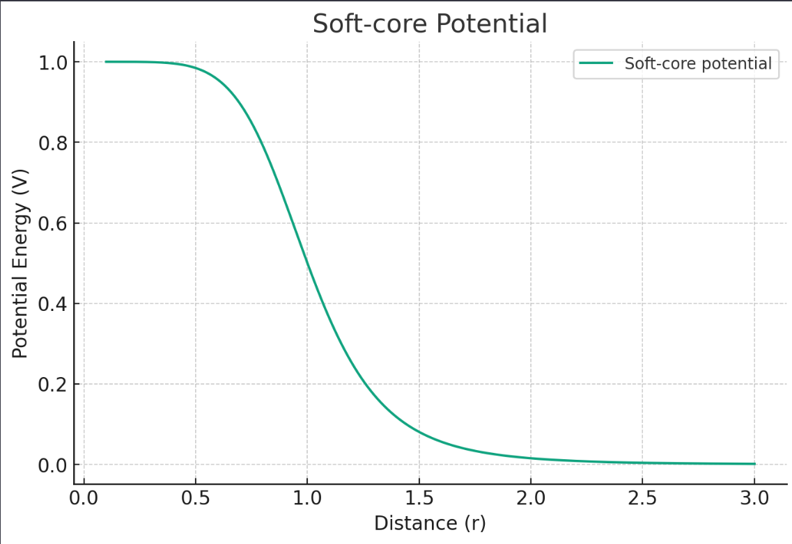
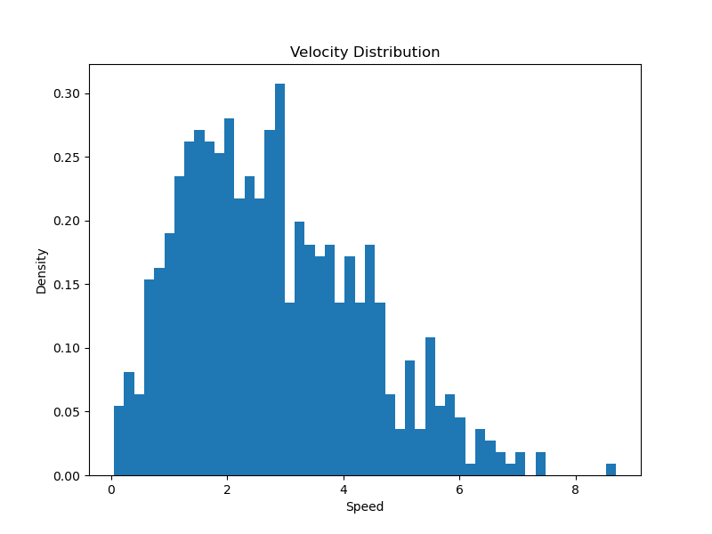
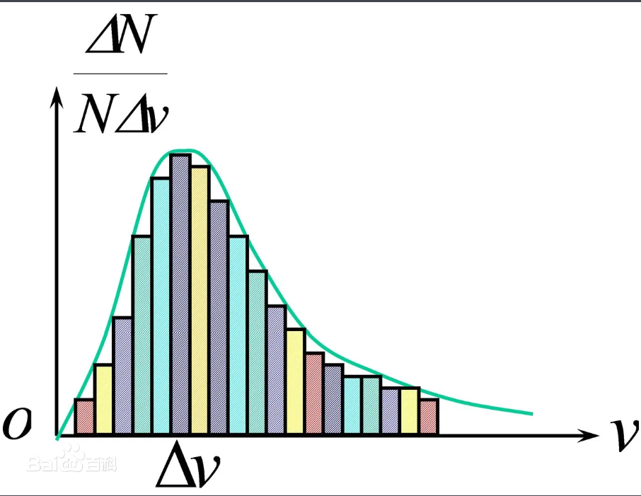
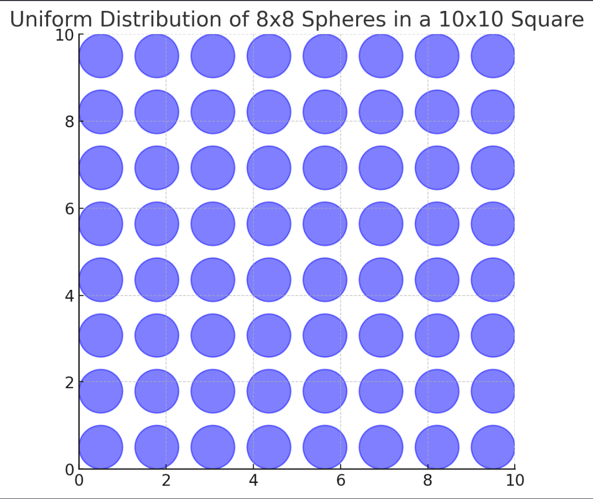
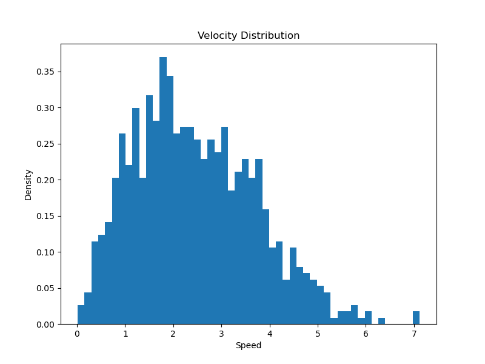

### 计算机模拟物理作业
##### 2023年11月20日
##### 夏泽宇 2021012242

##### 1.1
$基于题中所给温度，并利用公式\frac{3k_bT}{2}=\frac{mv^2}{2}初始化各粒子的速度：$
```python
    # 初始速度分布
    self.velocities = np.random.normal(0, 1, (n, 2))

    # 确保总动量为零
    self.velocities -= np.mean(self.velocities, axis=0)

    # 调整速度以匹配预期的总动能
    kinetic_energy = 0.5 * np.sum(self.velocities ** 2)
    desired_kinetic_energy = 1.5 * n * self.temperature 
    velocity_scale = np.sqrt(desired_kinetic_energy / kinetic_energy)
    self.velocities *= velocity_scale
```
$并使用velocity\_verlet方法进行模拟：$
```python
    # Velocity Verlet算法
    self.positions += self.velocities * dt + 0.5 * accelerations * dt**2
    new_accelerations = self.calculate_accelerations()
    self.velocities += 0.5 * (accelerations + new_accelerations) * dt
    accelerations = new_accelerations

    # 应用周期性边界条件
    self.positions %= self.L
```
$在初次进行模拟时，会遇到两粒子重叠导致某一时刻的粒子间作用力过大，从而导致仿真失真。$
$为了解决这一问题，采取的策略是当探测到粒子距离过近，使用软球势而非Lennard-Jones势来计算分子间作用力$
```python
    r_vec = self.positions[j] - self.positions[i]
    r_vec -= np.round(r_vec / self.L) * self.L
    r = np.linalg.norm(r_vec)

    if r < cutoff_distance:
        # 使用软球势
        potential_derivative = self.soft_core_potential(r)
        force_vec = -potential_derivative * r_vec / r
        accelerations[i] += force_vec
        accelerations[j] -= force_vec
    else:
        # 使用Lennard-Jones势
        force_magnitude = self.lj_force(r)
        force_vec = force_magnitude * r_vec / r
        accelerations[i] += force_vec
        accelerations[j] -= force_vec
```
\
$软球势：V(r)=\epsilon \frac{r_6}{1+r_6}，其中r_6=\left(\frac{\sigma}{r}\right)^6$


$计算得到平衡时温度为0.847,转换为国际单位制即为101.64K$
$由于没有散热途径，理论上该温度不应改变。但由于在实际中加入了周期性边界条件(即在二位方形区域外侧放置8个相同区块，计算最近粒子对的相互作用)，导致可能出现了能量损失$

##### 1.2
$在认识到初始粒子能量会有损失的情况下，考虑升高初始温度T>400K=\frac{400}{120}=3.33。经过尝试，取T=3.6=432K，v=3.18=499.3m/s。在题设单位制下，有理论速度：$
$$
\frac{3}{2}k_BT=\frac{1}{2}mv^2
\\v=\sqrt{\frac{3k_BT}{m}}=\sqrt{\frac{3\times1\times400/120}{1}}=3.162，与3.18相近
$$
$最后平衡温度为3.37=404K。其速度分布如下：$

$可以看出，该分布与气体速度的理论Maxwell分布(下图)：f(v)=4 \pi\left(\frac{m}{2 \pi k T}\right)^{\frac{3}{2}} e^{-\frac{m v^2}{2 k T}} v^2相近$



##### 1.3
$使用刚性球模拟分子运动，计算分子自由程的方法如下：$
$每个时间步更新所有粒子的距离上次碰撞时间：t'+=dt，并考察在当前时间步是否发生碰撞$
```python
    for step in range(num_steps):
    # 更新位置
    self.positions += self.velocities * dt

    # 更新自上次碰撞以来的时间
    self.time_since_last_collision += dt
    
    # 检测碰撞并更新速度
    for i in range(self.n):
        for j in range(i + 1, self.n):
            r_vec = self.positions[j] - self.positions[i]
            
            # 这里不应使用周期性边界条件
            # r_vec -= np.round(r_vec / self.L) * self.L  # 周期性边界条件
            r = np.linalg.norm(r_vec)

            if r < self.sigma:
                # 碰撞发生，重置碰撞时间
                self.time_since_last_collision[i] = 0
                self.time_since_last_collision[j] = 0
                
                # 计算径向单位向量
                r_hat = r_vec / r

                # 计算径向速度分量
                v1_radial = np.dot(self.velocities[i], r_hat)
                v2_radial = np.dot(self.velocities[j], r_hat)

                # 交换径向速度分量
                self.velocities[i] += (v2_radial - v1_radial) * r_hat
                self.velocities[j] += (v1_radial - v2_radial) * r_hat
                
                overlap = self.sigma - r
                displacement = (overlap / 2) * (r_vec / r)
                self.positions[i] -= displacement
                self.positions[j] += displacement
```
$计算得到平均自由程=0.1869，这是反常的。$
$通常情况下分子的平均自由程不会小于分子自身大小，但在本题中，分子的直径为\sigma=1，而整个区域的大小为10\times10，该区域的示意图是这样的：$

$可以看出，分子在该区域内运动时，存在的空隙区域很小，从而导致平均自由程的计算结果偏小。$

##### 2.1
$类似1.2的设定，通过调整参数可得以下结论：$
$平衡温度300K，初始T=2.7=324K，v=2.84=446.82m/s;$
$平衡温度400K，初始T=3.6=432K，v=3.29=515.95m/s;$

##### 2.2
$在2.1的基础上，绘制出速度分布图如下：$
$平衡温度300K：$


$平衡温度400K：$

$对比在不同温度下的速度分布可以得出，较高温度的速度分布的峰值在速度更大处取到，这是符合物理直觉的。$

##### 2.3
$使用python的ase包计算不同V下的P，并进行拟合(具体代码见/code/md.py)，得到a,b的模拟值如下$
$a = 0.05168,b因数值误差无法计算$
$查表发现a为理论值0.136 m^6 Pa/(mol)^2的一半$