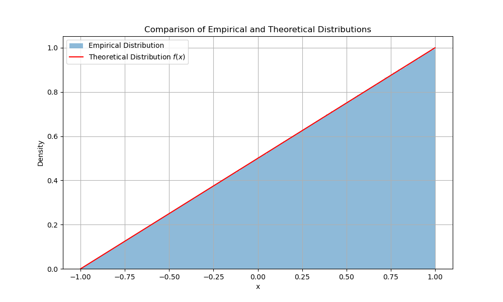

### 直接抽样
##### 2023年12月1日
##### 夏泽宇 2021012242

##### 1.实验原理
直接抽样法是指直接从目标分布中抽样，而不是通过其他分布的变换得到目标分布。通常对一个较为复杂的分布，常用的方法是挑选抽样方法(即接受-拒绝法)。但本次试验中的概率密度函数为$f(x)=\frac{1+x}{2}, x \in [-1,1]$较为简单，可以使用直接抽样法。

积分得$F(x)=\int_{-1}^xf(t)dt=\frac{(x+1)^2}{4}$，其反函数为$F^{-1}(x)=2\sqrt{x}-1$，因此可以通过$F^{-1}(x)$来抽样。

令随机变量$\xi\sim U(0,1)$，计算$F^{-1}(\xi)$，即可得到满足$f(x)$分布的随机变量。

##### 2.实验结果
在$N=10^8$次抽样中，得到的直方图如下：
\

可以看到，采样结果与理论分布吻合很好，这证明了直接抽样的有效性。直接抽样$10^8$次的耗时为$0.8178s$。

##### 3.分析讨论
直接抽样法的优点是简单有效，但是对于复杂的分布，很难找到其反函数，因此需要使用其他方法。我尝试了使用挑选法抽样，考虑$U(-0.5,0.5)$，计算得$M=\sup _{-\infty<x<\infty} \frac{f(x)}{h(x)}=2,h(x)=0.5$，以概率$eps<\frac{f(x)}{Mh(x)}=f(x)$接受抽样结果，否则拒绝。该抽样方法的效率为$\frac{1}{M}=0.5$，$10^8$次抽样耗时$6.3677s$，远大于直接抽样的耗时。抽样结果与直接抽样一致，直方图如下：
\

##### 4.实验代码
代码见：/code/main.py