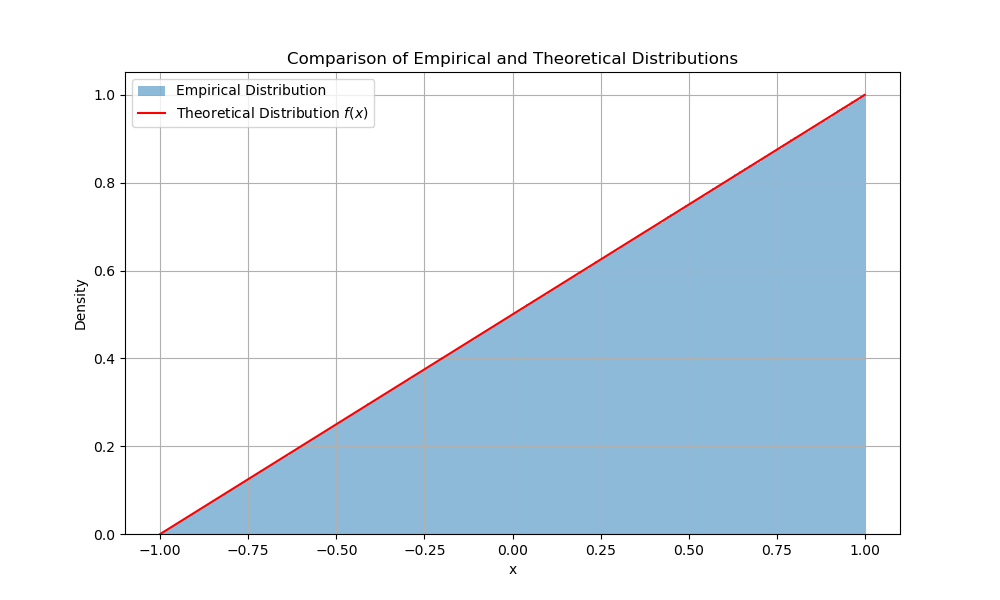

### 直接抽样
##### 2023年12月1日
##### 夏泽宇 2021012242

##### 1.实验原理
对称抽样要求取值区间关于原点对称，分布函数拆成奇偶函数和：
$f(x)=f_1(x)+H(x)$，其中$H(x)$为奇函数，$f_1(x)$为偶函数。
取$\eta\sim U(-1,1)$，若$\eta \le \frac{H(x_{f_1})}{f_1(x_1)}$，则取$x=x_{f_1}$，否则取$x=-x_{f_1}$，即可得到满足$f(x)$分布的随机变量。

##### 2.实验结果
在$N=10^8$次抽样中，得到的直方图如下：
\

可以看到，采样结果与理论分布吻合很好，这证明了直接抽样的有效性。对称抽样$10^8$次的耗时为$0.6885s$。

##### 3.分析讨论
理论上该方法通过分解原分布函数，避免了复杂数学运算。我将其与直接抽样对比，发现直接抽样$10^8$次抽样耗时$0.4759s$，略小于对称抽样的耗时。抽样结果与直接抽样一致，直方图如下：
\

##### 4.实验代码
代码见：/code/main.py