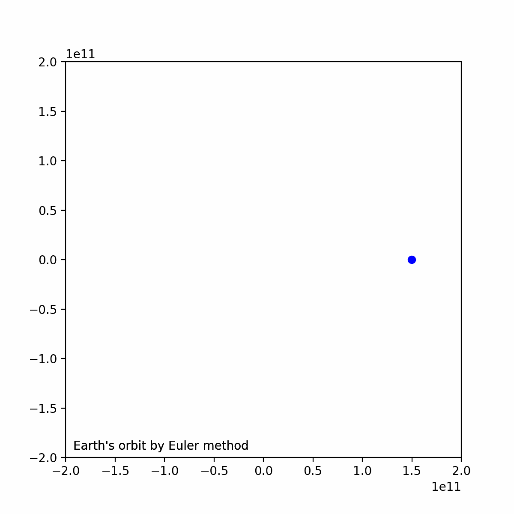
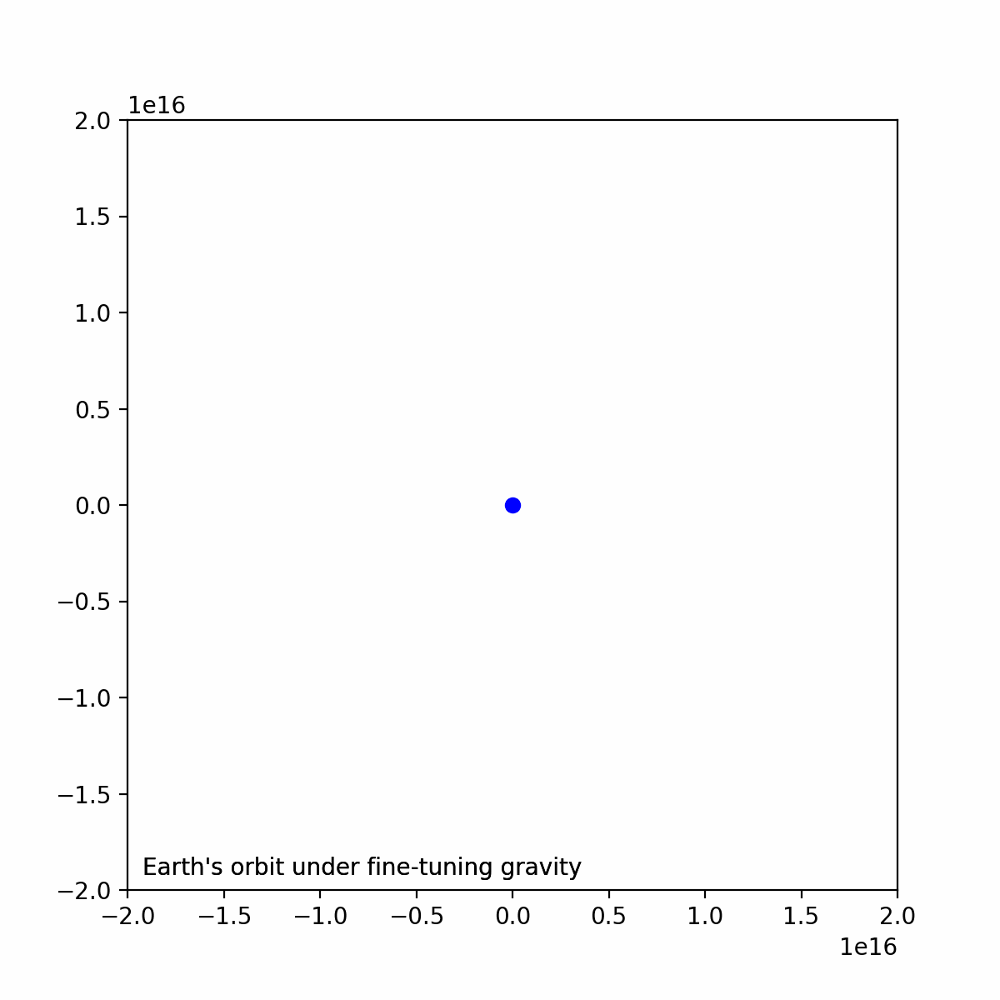
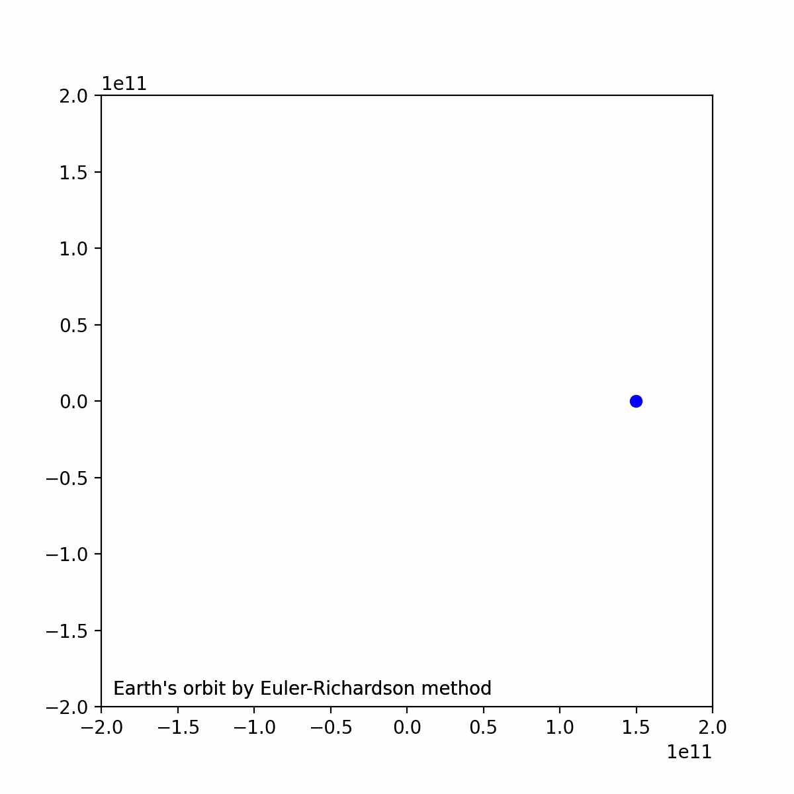

### 计算机模拟物理作业
##### 2023年9月27日
##### 夏泽宇 2021012242

*建议将仓库克隆到本地，使用支持Markdown语法的编辑器查看，如果没有编辑器可查看report.html。仓库地址：[Github](https://github.com/Ageha-Xia/simulation)*
##### 1.1 
$
地球绕太阳公转速度为2.978\times10^4 m/s。总时间t=365.243 \times 86400s（一年），时间步\Delta t=100s。使用Euler-Cromer法进行模拟结果如下：
$

$
使用Euler法进行模拟结果如下：
$

$
在该时间步的设定下，2种方法没有显著区别
$

##### 1.2
$
行星在t=0时位置为(1,0)，速度为(0,5)。这意味着行星在距太阳r_0=1AU，速度为5倍公转速度，且引力略微减小。
\\在这种设定下，轨道不会重叠，行星会飞离太阳，证明如下：
$
$$
\begin{aligned}
   对于正常速度正常引力的地球，\frac{GMm}{r^2}&=m\frac{v^2}{r}
    \\ E_k=\frac{1}{2}mv^2&=\frac{GMm}{2r}
    \\此时的引力势能E_p&=-\frac{GMm}r{}=-2E_k
    \\对于该5倍速度，引力减小的地球，动能&=\frac{1}{2}m(5v)^2>-E_p
    \\由于引力减小，实际的势能绝对值更小，&这意味着动能大于势能阱，会飞离
\end{aligned}
$$
$
使用Euler-Cromer模拟结果如下图：
$

##### 1.3
$$
\begin{aligned}
    \frac{GMm}{r^3}&=m\frac{v'^2}{r}
    \\ v'=\frac{\sqrt{GM}}{r}&=\frac{v}{\sqrt{r}}，其中r是日地距离
    \\因此取v_y&=\frac{1}{\sqrt{r}}\approx2.5855\times10^{-6}
    \\即v_y\approx2.5855\times 10^{-6}v，&其中v是实际地球公转速度
\end{aligned}
$$
$
在总时间t=10^{14}s下，若设时间步\Delta t为10^7s，仍可保持数圈内的圆周轨道，但当\Delta t=10^8s时，则无法保持。
\\\Delta t=10^7s设定下的轨道图：
$

##### 1.4
$
使用Euler-Richardson方法进行1.1问题的求解，轨道图如下：
$

##### 2.1
$
分别计算地球和木星近地点和远地点的值，结果如下：
\\ 地球远地点1.4960\times10^{11}m，近地点1.4958\times10^{11}，L2\_Error=0.012504\%
\\ 木星远地点7.7821\times10^{11}m，近地点7.7800\times10^{11}，L2\_Error=0.026836\%
\\二者的轨道可近似认为是圆，即偏心率接近0的椭圆
\\木星的轨道用Euler-Cromer法模拟如下：
$

##### 2.2
$
分别计算地球和木星在每相邻两个时间步的位置与原点组成的三角形的面积，并求平均值和误差：
\\ 每步地球平均面积2.2275\times10^{18}m^2,L2\_Error=2.3577\times10^{-111}\%
\\ 每步木星平均面积5.0803\times10^{18}m^2,L2\_Error=2.7357\times10^{-10}\%
\\可以看出对于每个行星而言，各自每步的面积是很接近的，由于设定的时间步\Delta t是均匀的，这验证了Kelper第二定律：行星和恒星的连线在相等的时间间隔内扫过相等的面积。
$

##### 2.3
$
计算地球和木星轨迹的半长轴和周期，结果如下：
\\地球：a^3/T^2=3.3616\times10^{18} m^2/s^3
\\地球：a^3/T^2=3.3623\times10^{18} m^2/s^3
\\二者的相对误差为1.9272\times10^{-2}\%
$

*本报告中所有试验结果可通过运行`main.py`，并修改调用函数进行复现*
*如果要运行第1题第2问的代码，可使用`python main.py 1 2`，其他问题更换后2个数字即可*